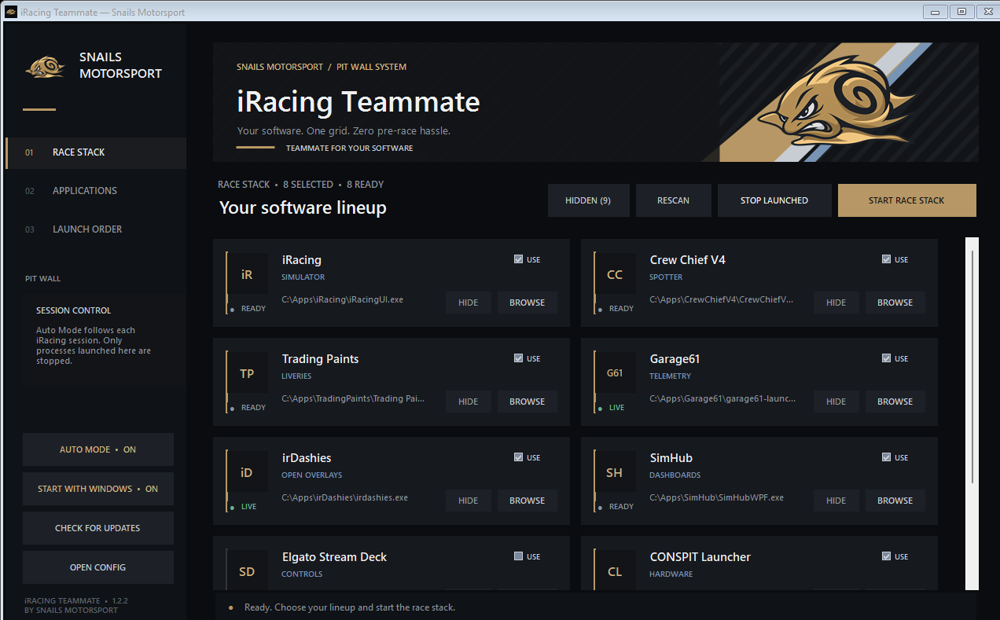

# iRacing Teammate

**Teammate for your software — by Snails Motorsport.**

A lightweight Windows pit-wall launcher that starts an iRacing software stack in a
predictable order and keeps the pre-race routine in one place.



## Download

Download the newest packaged build from the repository's
[latest GitHub Release](../../releases/latest). Extract the ZIP and run
`iRacing Teammate.exe`; no installer or administrator rights are required.

Windows SmartScreen may warn about unsigned community builds. Verify that the file
came from this repository's Releases page before running it.

## Features

- Snails Motorsport livery-inspired interface and embedded mascot.
- Automatic detection of iRacing and common companion applications.
- Sequential launch with an individual delay for every application.
- Live running-state indicators and configurable executable paths.
- Safe **Stop launched** action limited to process trees started by Teammate.
- Hide/show application cards without deleting their configuration.
- Optional **Start with Windows** toggle using the current user's standard Startup folder.
- Notification-area operation: Windows startup, the minimize button, and the window
  close button keep Teammate available beside the clock without occupying the taskbar.
- **Auto Mode** starts selected companion apps when an iRacing simulator session
  begins and stops only Teammate-launched apps after the session ends.
- GitHub Releases update check with confirmation before opening a download page.
- Persistent settings under `%APPDATA%\Snails Motorsport\iRacing Teammate`.

## Supported software

iRacing, Crew Chief V4, Trading Paints, Garage61, irDashies, GO Fast (GO Setups),
SimHub, iOverlay, Racelab, Elgato Stream Deck, CONSPIT Launcher, SimConnect
Manager, iRSidekick, VRS Telemetry Logger, Kapps, Joel Real Timing,
OpenKneeboard, and Marvin's AIRA.

Applications that are not detected automatically can be configured with **Browse**.

## Usage

1. Select **Rescan** after the first launch.
2. Use **Browse** for applications that were not detected.
3. Enable the applications that belong in the race stack with **Use**.
4. Select **Start race stack**.
5. Use **Stop launched** only when you intentionally want to close processes that
   were started by Teammate.

With **Auto Mode** enabled, Teammate starts with Windows and waits in the background
for `iRacingSim*`. Starting the iRacing UI alone does not trigger companion apps;
they start when the simulator session process appears. A three-second confirmation
window prevents a brief process transition from triggering premature cleanup.

Closing Teammate itself does not close racing software.
Use **Exit** from the notification-area icon menu when you want to stop Teammate
completely. Double-click the icon to restore the main window.

## Building from source

Requirements:

- Windows 10 or Windows 11
- .NET Framework C# compiler at
  `C:\Windows\Microsoft.NET\Framework64\v4.0.30319\csc.exe`
- Windows PowerShell

Build locally:

```powershell
.\build.ps1
```

To embed a GitHub update source in a local build:

```powershell
.\build.ps1 -UpdateRepository "owner/iRacing-Teammate"
```

The executable is written to `dist\iRacing Teammate.exe`. `version.txt` is the
single source of truth for the application version.

## Publishing a release

1. Update `version.txt` and `CHANGELOG.md`.
2. Commit the change.
3. Create and push a matching tag, for example `v1.2.0`.
4. GitHub Actions builds the executable, creates a ZIP and SHA-256 checksum, and
   publishes a GitHub Release with generated notes.

The release build automatically embeds the repository identity supplied by GitHub,
so **Check for updates** points to the correct Releases feed without manual source edits.

## Project policy

See [CONTRIBUTING.md](CONTRIBUTING.md) before proposing changes and
[SECURITY.md](SECURITY.md) for responsible vulnerability reporting.

## License and trademarks

Copyright © 2026 Snails Motorsport. All rights reserved. See [LICENSE](LICENSE).

iRacing and the names of third-party companion applications are trademarks of their
respective owners. This independent project is not affiliated with or endorsed by
iRacing.com Motorsport Simulations or the listed third-party application vendors.
